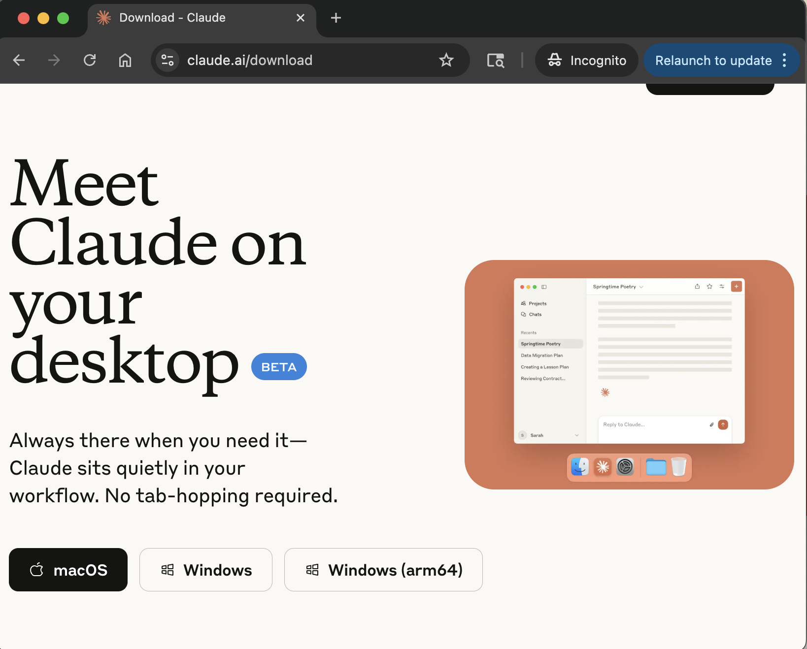
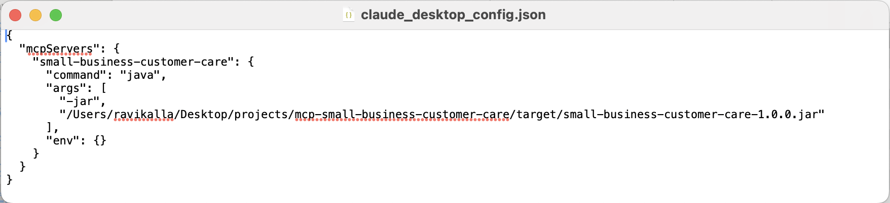
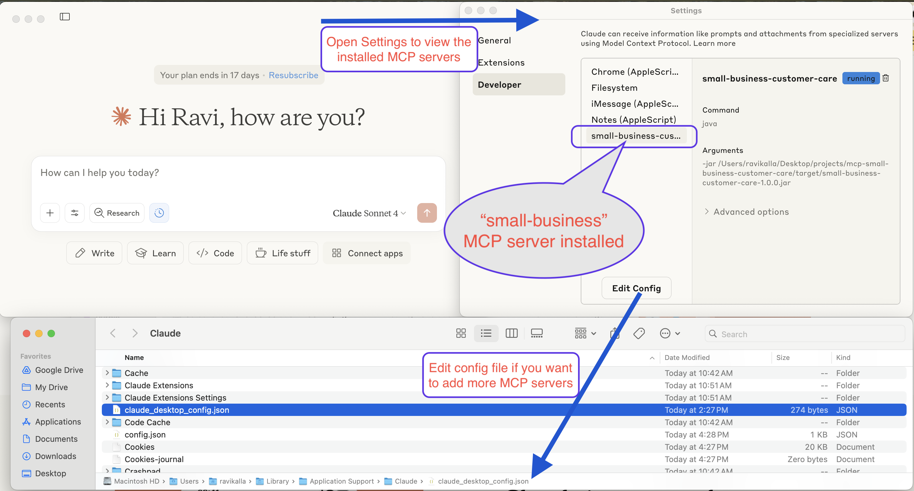
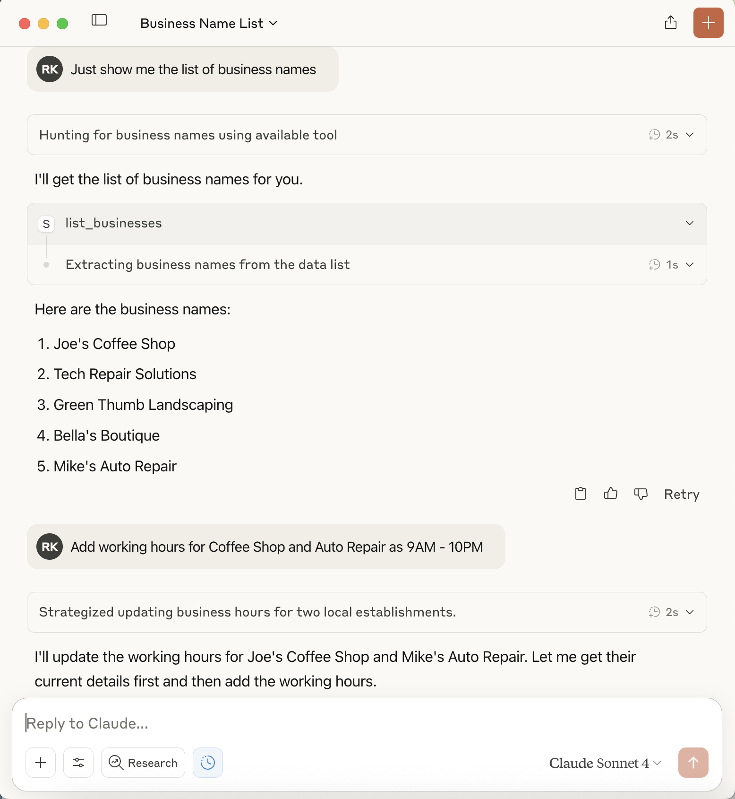

# 🏪 Small Business Customer Care MCP Server

[](https://openjdk.java.net/projects/jdk/17/)
[](https://spring.io/projects/spring-boot)
[](https://spring.io/projects/spring-ai)
[](https://modelcontextprotocol.io/)

A **Spring AI-powered MCP (Model Context Protocol) server** for managing small business customer care operations through AI assistants like Claude Desktop.

## 💬 See It In Action

Here's what you can do with this MCP server through natural conversation with Claude Desktop:

| 👤 **User** | 🤖 **Claude (via MCP)** | 🔧 **What Happened** |
|-------------|-------------------------|----------------------|
| "Show me the list of businesses" | Lists all 5 businesses with their details and categories | Used `list_businesses` tool |
| "Delete green thumb business" | ✅ "Deleted: Green Thumb Landscaping business" | Used `remove_business` with ID "3" |
| "Create new business called Ravi Restaurant that opens at 9AM and closes at 5PM" | ✅ "Created: Ravi Restaurant<br/>• Category: Restaurant<br/>• Hours: 9:00 AM - 5:00 PM daily<br/>• Location: 789 Pine Rd, Springfield" | Used `create_business` with hours in description |
| "Mike's auto repair shop opens at 1PM and closes at 9PM" | ✅ "Updated: Mike's Auto Repair<br/>• Hours: 1:00 PM - 9:00 PM daily<br/>• All other details preserved" | Used `update_business` to add hours |
| "Show me the list of business names" | **Current businesses:**<br/>• Joe's Coffee Shop<br/>• Tech Repair Solutions<br/>• Bella's Boutique<br/>• Mike's Auto Repair (Hours: 1:00 PM - 9:00 PM)<br/>• Ravi Restaurant (Hours: 9:00 AM - 5:00 PM)<br/><br/>**Total: 5 businesses** | Used `list_businesses` and formatted response |
| "Find all restaurants" | Shows Ravi Restaurant and Joe's Coffee Shop with full details | Used `search_businesses` with query "restaurant" |

**🎯 The Power**: Natural language → Structured business operations → Real data management

## ⚡ Claude Desktop Setup

### **Step 1: Download Claude Desktop**
Download and install Claude Desktop from the official website:
- **Official Download**: [https://claude.ai/download](https://claude.ai/download)
- Available for **macOS**, **Windows**, and **Linux**


*Download Claude Desktop from the official website*

### **Step 2: Build the MCP Server**
```bash
# Clone and build the project
git clone https://github.com/ravikalla/mcp-small-business-customer-care.git
cd mcp-small-business-customer-care
mvn clean package

# Verify JAR creation
ls -la target/small-business-customer-care-1.0.0.jar
```

### **Step 3: Configure Claude Desktop**
Open the Claude Desktop configuration file:

**📍 Configuration File Locations:**
- **macOS**: `~/Library/Application Support/Claude/claude_desktop_config.json`
- **Windows**: `%APPDATA%\Claude\claude_desktop_config.json`
- **Linux**: `~/.config/Claude/claude_desktop_config.json`

**💡 Tip**: On macOS, you can quickly open the config file:
```bash
open "~/Library/Application Support/Claude/claude_desktop_config.json"
```

**Add this configuration:**
```json
{
  "mcpServers": {
    "small-business-customer-care": {
      "command": "java",
      "args": [
        "-jar",
        "/absolute/path/to/your/mcp-small-business-customer-care/target/small-business-customer-care-1.0.0.jar"
      ],
      "env": {}
    }
  }
}
```


*Example configuration file with MCP server entry*

**⚠️ Important Notes:**
- Replace `/absolute/path/to/your/` with your actual project path
- Use **absolute paths only** (e.g., `/Users/john/projects/mcp-small-business-customer-care/target/...`)
- On Windows, use forward slashes: `C:/Users/john/projects/...`

### **Step 4: Restart Claude Desktop**
**Completely quit and reopen** Claude Desktop after updating the configuration:
- **macOS**: Cmd+Q to quit, then reopen from Applications
- **Windows**: Right-click system tray icon → Exit, then reopen
- **Alternative**: Close all Claude Desktop windows and reopen the application


*Use Cmd+Q to quit Claude Desktop on macOS*

The MCP server should now be available.

### **Step 5: Verify Connection**
1. **Check Developer Settings**: Go to Claude Desktop Settings → Developer tab to see your MCP server running
2. **Test the tools**: Try asking:
   - *"Show me all businesses"*
   - *"What business tools are available?"*


*The MCP server running successfully in Claude Desktop's developer settings*

You should see the business management tools working! 🎉


*Example conversation showing the MCP tools in action*

**📚 Additional Resources:**
- [Claude Desktop MCP Documentation](https://modelcontextprotocol.io/clients#claude-desktop)
- [MCP Troubleshooting Guide](https://modelcontextprotocol.io/docs/troubleshooting)
- [Spring AI MCP Documentation](https://docs.spring.io/spring-ai/reference/api/mcp.html)

## 🚀 Quick Start

### **Prerequisites**
- Java 17 or higher
- Maven 3.6 or higher
- Claude Desktop (for AI assistant integration)

### **Installation & Build**
```bash
# Clone the repository
git clone https://github.com/ravikalla/mcp-small-business-customer-care.git
cd mcp-small-business-customer-care

# Build the application
mvn clean package

# Verify the JAR was created
ls -la target/small-business-customer-care-1.0.0.jar
```

### **Testing the Server**
```bash
# Test initialization
echo '{"jsonrpc":"2.0","method":"initialize","params":{"protocolVersion":"2024-11-05"},"id":0}' | java -jar target/small-business-customer-care-1.0.0.jar

# Test business listing
echo '{"jsonrpc":"2.0","method":"tools/call","params":{"name":"list_businesses","arguments":{}},"id":2}' | java -jar target/small-business-customer-care-1.0.0.jar
```

## 🔧 Claude Desktop Integration

Add this configuration to your Claude Desktop config file:
- **macOS**: `~/Library/Application Support/Claude/claude_desktop_config.json`
- **Windows**: `%APPDATA%\Claude\claude_desktop_config.json`

```json
{
  "mcpServers": {
    "small-business-customer-care": {
      "command": "java",
      "args": [
        "-jar",
        "/path/to/your/mcp-small-business-customer-care/target/small-business-customer-care-1.0.0.jar"
      ],
      "env": {}
    }
  }
}
```

**Important**: Replace `/path/to/your/` with the actual absolute path to your project directory.

**Restart Claude Desktop** completely after updating the configuration.

## 🛠️ Available Business Tools

The server provides 6 MCP tools for complete business management:

| Tool | Purpose | Example Usage |
|------|---------|---------------|
| `list_businesses` | Get all businesses | "Show me all businesses" |
| `search_businesses` | Find by name/category/description | "Find restaurants" |
| `get_business` | Get details by ID | "Show details for business 1" |
| `create_business` | Add new business | "Create Ravi Restaurant..." |
| `update_business` | Modify existing business | "Update business hours for..." |
| `remove_business` | Delete business | "Delete green thumb business" |

### **JSON API Examples**
```json
// Create new business
{
  "method": "tools/call",
  "params": {
    "name": "create_business",
    "arguments": {
      "name": "Ravi Restaurant",
      "category": "Restaurant", 
      "address": "789 Pine Rd, Springfield",
      "phone": "555-0106",
      "email": "info@ravirestaurant.com",
      "description": "Family-friendly restaurant. Hours: 9:00 AM - 5:00 PM daily",
      "rating": 4.5
    }
  }
}

// Search businesses
{
  "method": "tools/call",
  "params": {
    "name": "search_businesses",
    "arguments": { "query": "restaurant" }
  }
}
```

## 🏗️ Technical Architecture

Built with **Spring AI MCP Framework**:
- Uses `spring-ai-mcp-server-spring-boot-starter` for robust MCP protocol handling
- Annotation-driven tool definitions with `@Tool`
- Automatic tool discovery via `ToolCallbacks.from()`
- Clean STDIO transport with proper logging configuration

```java
@Service
public class BusinessService {
    @Tool(name = "list_businesses", description = "Get a list of all businesses")
    public List<Business> listBusinesses() { ... }
    
    @Tool(name = "search_businesses", description = "Search businesses by name, category, or description")
    public List<Business> searchBusinesses(String query) { ... }
    // ... other tool methods
}
```

## 🧪 Development & Testing

```bash
# Run all tests
mvn test

# Start in development mode  
mvn spring-boot:run

# Build for production
mvn clean package -DskipTests
```

**Sample Data**: The server comes pre-loaded with 5 businesses:
Joe's Coffee Shop, Tech Repair Solutions, Green Thumb Landscaping, Bella's Boutique, Mike's Auto Repair

## 🔧 Troubleshooting

**Server Not Connecting:**
1. Verify Java 17+: `java -version`
2. Check JAR exists: `ls -la target/small-business-customer-care-1.0.0.jar`
3. Test manually with echo commands above
4. Restart Claude Desktop completely

**Build Issues:**
```bash
mvn clean package -DskipTests  # Skip tests if failing
mvn clean package -X          # Verbose output
```

**Path Issues:**
- Use absolute paths in Claude Desktop configuration
- Escape spaces with quotes: `"/path with spaces/"`

## 📚 Resources

- [Model Context Protocol Specification](https://modelcontextprotocol.io/)
- [Spring AI Documentation](https://spring.io/projects/spring-ai)
- [Claude Desktop MCP Setup](https://claude.ai/docs)

## 📄 License

This project is open source and available under the MIT License.

---

**Ready to use?** Follow the Claude Desktop integration steps above and start managing your business data with AI! 🚀